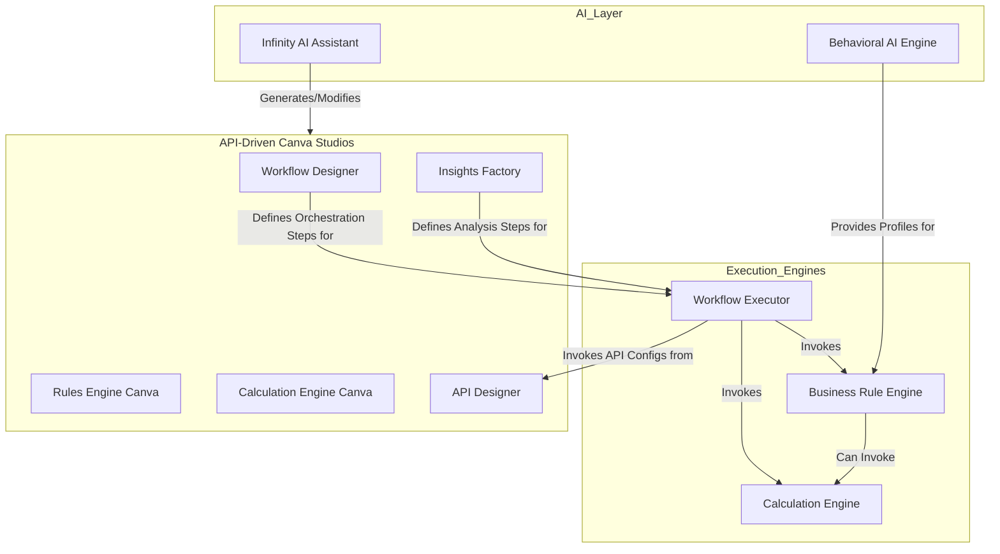

# 4. The Canva Studio & AI Ecosystem Framework

*   **Status**: Accepted
*   **Date**: 2026-06-13

## Context

To achieve extreme business agility, the platform must empower non-technical users to design, configure, and deploy complex financial products and processes. This requires abstracting all business logic away from hardcoded Python and into a suite of interconnected, user-friendly visual studios. Furthermore, this entire ecosystem must be programmatically accessible to an AI layer for automation and intelligent assistance.

## Decision

We will implement a suite of distinct, API-driven "Canva" studios, each responsible for a specific domain of logic. These studios are orchestrated by a central Workflow Engine and augmented by a multi-faceted AI layer. All components communicate via well-defined APIs and a central event bus.

### Component Breakdown & Interlinkages

#### 1. Foundational Canvases (The Building Blocks)

*   **Field Registry Architecture**:
    *   **Purpose**: The single source of truth for all data fields in the system. It defines the "vocabulary" for all other engines.
    *   **Execution Proof**: `models.ISOFieldDefinition` (especially `technical_sys_name` and `localized_names` fields); `routers/registry.py` (API for management).

*   **Calculation Engine Canva**:
    *   **Purpose**: Defines reusable, named mathematical formulas (e.g., "Calculate Net Interest Margin") as data.
    *   **Interlinkage**: These formulas (`SymbolicFormulaAsset`) are invoked by the Business Rule Engine and the Workflow Orchestrator.
    *   **Execution Proof**: `models.SymbolicFormulaAsset`; `services/calculation_engine.py`; `routers/calculations.py`.

*   **Domain-Driven API Designer Canva**:
    *   **Purpose**: Defines the contracts and endpoints for all internal and external API calls, decoupling the workflow from the integration details.
    *   **Interlinkage**: These API configurations (`ApiConfiguration`) are invoked by the Workflow Orchestrator.
    *   **Execution Proof**: `models.ApiConfiguration`; `routers/integrations.py`; `routers/domain_apis.py`.

*   **DataGateway Engine (Mapper)**:
    *   **Purpose**: Defines reusable templates (`PayloadMapperBlueprint`) for transforming structured data (e.g., SWIFT, CSV, JSON) into the platform's standard ISO 20022-based format. This is a core component of Layer 4.
    *   **Interlinkage**: A `PayloadMapperBlueprint` can invoke the **Business Rule Engine** and **Calculation Engine** on a per-field basis during the transformation process. This is typically the first step in a data ingestion workflow.
    *   **Execution Proof**: `models.PayloadMapperBlueprint`; `routers/mappers.py`.

*   **Event Repository & Architecture**:
    *   **Purpose**: A discoverable dictionary of all business events the system can emit or react to, enabling a decoupled, reactive system.
    *   **Interlinkage**: The event bus is the central nervous system. Events can trigger Workflows, Insights, and Business Rule Sets. The Workflow Orchestrator can also broadcast events as part of a process.
    *   **Execution Proof**: `models.EventDefinition`; `routers/events.py`; `event_bus.py`; `services/event_handlers.py`.

#### 2. Logic Composition Canvases (The "How")

*   **Business Rules Engine Canva**:
    *   **Purpose**: Defines complex `IF-THEN` conditional logic (e.g., "IF amount > 1M THEN set status to 'APPROVAL_REQUIRED'") as structured data.
    *   **Interlinkage**: A `BusinessRuleSet` can be triggered by an event or invoked by a workflow. It can use the **Calculation Engine** to perform math within its conditions and can be used to conditionally activate workflow edges or orchestration steps.
    *   **Execution Proof**: `models.BusinessRuleSet` (and its `definition` JSONB field); `services/business_rule_engine.py`; `routers/rules.py`.

*   **Insights Factory Canva**:
    *   **Purpose**: Defines proactive "smart insights" that analyze data to find opportunities or risks.
    *   **Interlinkage**: An `InsightDefinition` is triggered by an `EVENT` or a `SCHEDULE`. Its analysis logic is a sequence of orchestration steps that can invoke the **Business Rule Engine** and **Calculation Engine**. Its final action is typically to broadcast a new, specific insight event.
    *   **Execution Proof**: `models.InsightDefinition` (and its `analysis_steps` field); `services/ai_services.py::InsightsOrchestrator`; `routers/insights.py`.

#### 3. The Master Orchestration Layer

*   **Workflow Designer & Orchestration Canva**:
    *   **Purpose**: The master canvas that defines the end-to-end business process by sequencing steps (nodes) and defining the paths (edges) between them as a graph data structure.
    *   **Interlinkage**: This is the primary consumer of all other components. Each `WorkflowNode` contains a list of `orchestration_steps`, which can invoke the **Business Rule Engine**, **Calculation Engine**, or **API Configurations**. The `WorkflowEdge`s between nodes are conditional on the outcomes of **Business Rules**.
    *   **Execution Proof**: `models.WorkflowConfiguration`, `models.WorkflowNode` (and its `orchestration_steps` field), `models.WorkflowEdge`; `services/workflow_executor.py`; `routers/workflows.py`.

#### 4. The AI Layer (The "Intelligence")

*   **Behavioral & Predictive AI**:
    *   **Purpose**: To understand and model user behavior over time by aggregating raw interaction data into stateful profiles.
    *   **Interlinkage**: It logs all user interactions (`UserInteractionEvent`) and uses a scheduled job to aggregate this data into a `CustomerBehavioralProfile`. This profile is then used by the **Insights Factory** and **Business Rule Engine** to detect anomalies.
    *   **Execution Proof**: `models.UserInteractionEvent` (raw data); `models.CustomerBehavioralProfile` (aggregated state); `services/ai_services.py::_update_all_behavioral_profiles`.

*   **Conversational AI & Infinity AI Assistant**:
    *   **Purpose**: To provide a natural language interface for both end-users (querying their data) and business users (configuring the system).
    *   **Interlinkage**: This is the highest-level orchestrator. The AI Assistant (`/api/v1/assistant/execute-command`) parses a natural language prompt and programmatically calls the APIs of the various Canva studios (`/rules`, `/insights`, `/workflows`, etc.) to create or modify logic assets.
    *   **Execution Proof**: `routers/ai_assistant.py`; `services/ai_services.py::parse_and_execute_command`; `services/ai_services.py::generate_rule_from_prompt`.

#### 5. Enterprise Governance, Security & Globalization Framework

*   **Governance by Design (4-Eye & RBAC)**:
    *   **Purpose**: To ensure critical state changes or manual interventions are subject to a "4-Eye Check" and that all system actions are governed by Role-Based Access Control (RBAC).
    *   **Interlinkage**: The `GovernanceGateHub` service intercepts failed or high-risk transactions. The `auth.py` service provides RBAC dependencies (`require_admin`, `require_designer_privileges`) that protect every API endpoint.
    *   **Execution Proof**: `services/governance_gate.py`; `auth.py`; `routers/governance.py`.

*   **Security by Default (PII Data Masking)**:
    *   **Purpose**: To ensure Personally Identifiable Information (PII) is never exposed in logs or to unauthorized systems.
    *   **Interlinkage**: The `DataMaskingService` is used by the `WorkflowExecutor` before returning any final context. It uses metadata from the **Field Registry** (`is_pii` flag).
    *   **Execution Proof**: `services/data_masking.py`; `models.ISOFieldDefinition` (`is_pii` flag); `services/workflow_executor.py`.

*   **Global Localization Framework (Multi-Country & Multi-Lingual)**:
    *   **Purpose**: To ensure the platform is natively multilingual and aware of jurisdictional differences in rules and data.
    *   **Interlinkage**: The **Field Registry** (`localized_names`) acts as a multilingual dictionary. The `WorkflowExecutor` can apply dynamic, country-specific compliance rules.
    *   **Execution Proof**: `models.ISOFieldDefinition` (`localized_names`); `services/workflow_executor.py` (`_apply_localized_compliance_rules` method).

## Consequences

*   **Pros**:
    *   **Extreme Agility**: The "Logic-as-Data" and modular design allows for rapid configuration of new products and processes with zero downtime.
    *   **Composability**: Complex capabilities are not built monolithically; they are composed by linking together specialized, reusable assets from the different factories.
    *   **Clear Separation of Concerns**: Each engine has a single, well-defined responsibility, making the system easier to maintain, test, and scale.
    *   **AI-Native**: The entire system is designed to be understood and manipulated by an AI, enabling a new level of automation and intelligent assistance.

*   **Cons**:
    *   **High Initial Complexity**: The architecture requires a deep understanding of how the different components interoperate.
    *   **Distributed Logic**: Business logic is not in one place but is distributed across different asset types (Workflows, Rules, Insights). This requires robust UIs and search capabilities to manage effectively.

## Visualizing the Interlinkages

